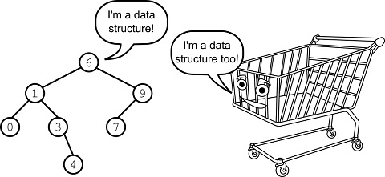
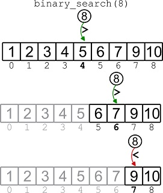

# Grokking Data Structures

[](https://www.manning.com/books/grokking-data-structures)

### To Run All Tests: 
From the `./python` folder, run
```console
python -m unittest tests/test_*
```

## Note on Python

The code in the book also doesn’t have type hints, which you can find instead in the version hosted here on GitHub. This decision was made to reduce code clutter and to avoid additional cognitive load for beginners who may not be familiar with type hints in Python. Similarly, the book doesn't include tests.

However, in this repository you have the chance to find the full code with type hints, and tests.

# **Introduction**
## | [Chapter 1](https://livebook.manning.com/book/grokking-data-structures/chapter-1) |


# **Static (Unsorted) Arrays**
## | [Chapter 2](https://livebook.manning.com/book/grokking-data-structures/chapter-2) | [Python](https://github.com/mlarocca/gda/blob/main/python/arrays/unsorted_array.py) |


### Run Tests: 
From the `./python` folder, run
```console
python -m unittest tests/test_unsorted_array.py
```

# **Sorted Arrays**
## | [Chapter 3](https://livebook.manning.com/book/grokking-data-structures/chapter-3) | [Python](https://github.com/mlarocca/gda/blob/main/python/arrays/sorted_array.py) |



### Run Tests: 
From the `./python` folder, run
```console
python -m unittest tests/test_sorted_array.py
``` 

# **Big-O Notation**
## | [Chapter 4](https://livebook.manning.com/book/grokking-data-structures/chapter-4) |


# **Dynamic Arrays**
## | [Chapter 5](https://livebook.manning.com/book/grokking-data-structures/chapter-5) | [Python](https://github.com/mlarocca/gda/blob/main/python/arrays/dynamic_array.py) |


### Run Tests: 
From the `./python` folder, run
```console
python -m unittest tests/test_dynamic_array.py
```

# **Linked Lists**
## | [Chapter 6](https://livebook.manning.com/book/grokking-data-structures/chapter-6) |

### Singly-Linked Lists | [Python](https://github.com/mlarocca/gda/blob/main/python/linked_lists/singly_linked_list.py) |


#### Run Tests: 
From the `./python` folder, run
```console
python -m unittest tests/test_singly_linked_list.py
```

### Sorted Singly-Linked Lists | [Python](https://github.com/mlarocca/gda/blob/main/python/linked_lists/sorted_singly_linked_list.py) |


#### Run Tests: 
From the `./python` folder, run
```console
python -m unittest tests/test_sorted_singly_linked_list.py
```

### Doubly-Linked Lists | [Python](https://github.com/mlarocca/gda/blob/main/python/linked_lists/doubly_linked_list.py) |


#### Run Tests: 
From the `./python` folder, run
```console
python -m unittest tests/test_doubly_linked_list.py
```

# **Bags**
## | [Chapter 7](https://livebook.manning.com/book/grokking-data-structures/chapter-7) | [Python](https://github.com/mlarocca/gda/blob/main/python/bags/bag.py) |


### Run Tests: 
From the `./python` folder, run
```console
python -m unittest tests/test_bag.py
```

# **Stacks**
## | [Chapter 8](https://livebook.manning.com/book/grokking-data-structures/chapter-8) | [Python](https://github.com/mlarocca/gda/blob/main/python/stacks/stack.py) |


### Run Tests: 
From the `./python` folder, run
```console
python -m unittest tests/test_stack.py
```

# **Queues**
## | [Chapter 9](https://livebook.manning.com/book/grokking-data-structures/chapter-9) | [Python](https://github.com/mlarocca/gda/blob/main/python/queues/queue.py) |


### Run Tests: 
From the `./python` folder, run
```console
python -m unittest tests/test_queue.py
```

# **Priority queues and heaps**
## | [Chapter 10](https://livebook.manning.com/book/grokking-data-structures/chapter-10) | [Python](https://github.com/mlarocca/grokking_data_structures/blob/main/python/queues/heap.py) |


### Run Tests: 
From the `./python` folder, run
```console
python -m unittest tests/test_heap.py
```

# **Binary search trees**
## | [Chapter 11](https://livebook.manning.com/book/grokking-data-structures/chapter-11) | [Python](https://github.com/mlarocca/grokking_data_structures/blob/main/python/trees/bst.py) |


### Run Tests: 
From the `./python` folder, run
```console
python -m unittest tests/test_bst.py
```

# **Dictionaries and hash tables**
## | [Chapter 12](https://livebook.manning.com/book/grokking-data-structures/chapter-12) | [Python](https://github.com/mlarocca/grokking_data_structures/blob/main/python/dictionaries/hash_table.py) |


### Run Tests: 
From the `./python` folder, run
```console
python -m unittest tests/test_hash_table.py
```

# **Graphs**
## | [Chapter 13](https://livebook.manning.com/book/grokking-data-structures/chapter-13) | [Python](https://github.com/mlarocca/grokking_data_structures/blob/main/python/graphs/graph.py) |


### Run Tests: 
From the `./python` folder, run
```console
python -m unittest tests/test_graph.py
```